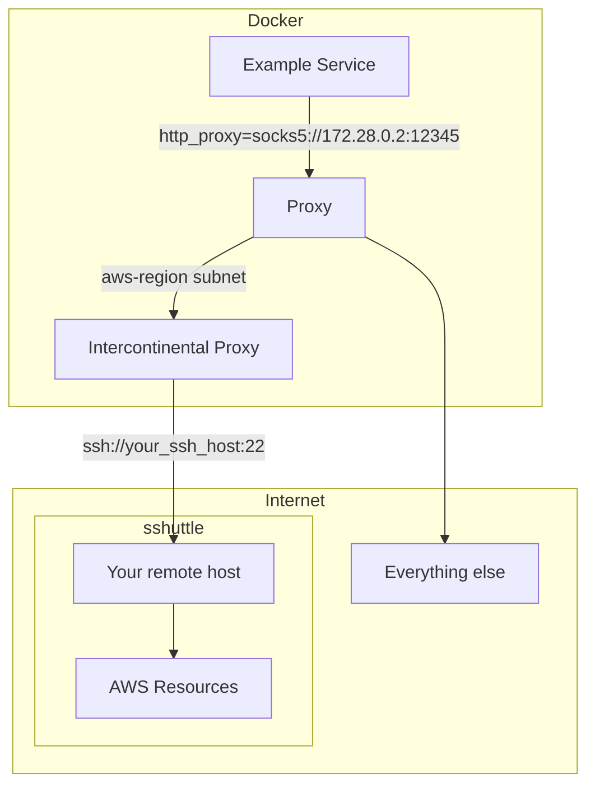

# Intercontinental


Selectively proxy traffic via sshuttle to AWS regions.

## Use Cases

- CI/CD environments where you need to proxy your traffic to AWS via another machine due to bad peering connections.
- Connecting to AWS resources when you are using security groups to restrict access to a particular IP address.
- Working with AWS resources in regions where your ISP has restrictions, or AWS is restricting your access. 

## Installation

1. Ensure you have the following installed:
    - Ruby (version 3.2 or higher recommended)
    - Bundler
    - SSHuttle
2. Clone this repository.
3. Run `bundle install` to install dependencies.

## Usage

Run the script with the following command:
```
ruby app.rb --region <region> --ssh-host <ssh-host> [--options <additional-options>] [--aws-ip-url <custom-url>]
```

Options:
- `-r`, `--region REGION`: AWS region (required, use 'all' for all regions)
- `-s`, `--ssh-host HOST`: SSH host to connect through (required)
- `-o`, `--options OPTIONS`: Additional sshuttle options (optional)
- `-u`, `--aws-ip-url URL`: Custom URL for AWS IP ranges JSON (optional)

Examples:
```
# Proxy traffic to a single AWS region.
ruby app.rb -r us-west-2 -s user@example.com -o "--verbose"

# Proxy traffic to all AWS regions.
ruby app.rb -r all -s user@example.com -o "--verbose"

# Proxy traffic to all AWS regions with sshuttle listening on all interfaces.
# This is useful within a Docker network to connect to the proxy from other containers.
ruby app.rb -r all -s user@example.com -o "-l 0.0.0.0 --verbose"

# Proxy traffic to all AWS regions with a custom URL for the AWS IP ranges JSON.
ruby app.rb -r all -s user@example.com -o "--verbose" -u "https://ip-ranges.notamazonaws.com/ip-ranges.json"
```

## Usage within Docker

See the `docker-compose.yml` file for an example of how to use Intercontinental with Docker networks.

A use-case for this is when you need to MITM all traffic to AWS within Docker Compose, forwarding it over a SOCKS5 proxy to the container running Intercontinental. The container running Intercontinental is also running dante-server, which is a SOCKS5 proxy.

The way this has been implemented leaves it hot-pluggable, so you can switch from dante-server to another proxy by editing the Dockerfile.



## Notes

- All other traffic will continue to use your current connection, which allows you to use the proxy selectively in environments such as a CI where you need to proxy your traffic to AWS via another machine.

- This script automatically caches the AWS IP ranges JSON using the ETag header to avoid downloading the large JSON file from the AWS API on every run.

- Note: Press CTRL+C to stop the proxy.
